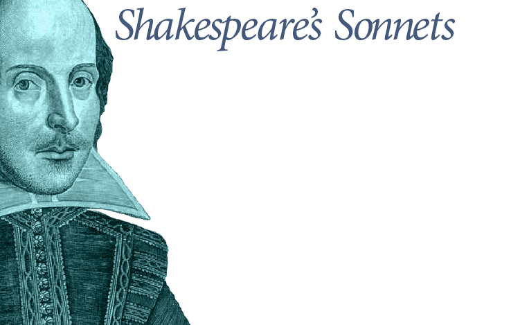

# Shakespeare once said...

## 009 sonnet

Is it for fear to wet a widow's eye,
That thou consum'st thy self in single life?
Ah, if thou issueless shalt hap to die,
The world will wail thee like a makeless wife,
The world will be thy widow and still weep,
That thou no form of thee hast left behind,
When every private widow well may keep,
By children's eyes, her husband's shape in mind:
Look what an unthrift in the world doth spend
Shifts but his place, for still the world enjoys it;
But beauty's waste hath in the world an end,
And kept unused the user so destroys it:
No love toward others in that bosom sits
That on himself such murd'rous shame commits.

Images are inserted like this:

[from http://poetry.eserver.org/sonnets/009.html](http://poetry.eserver.org/sonnets/009.html)